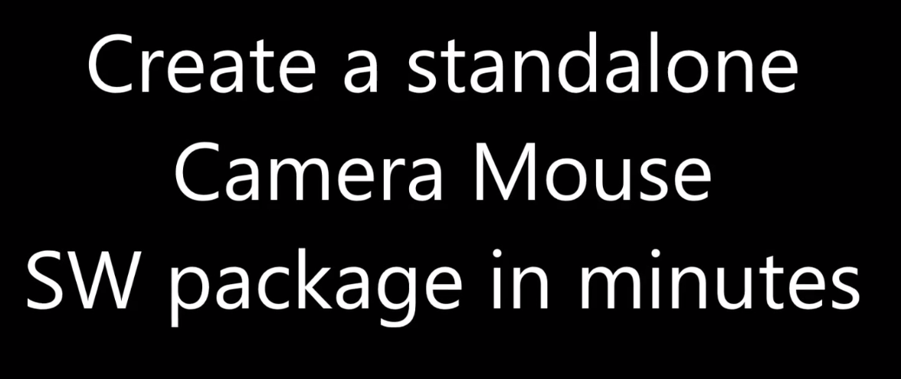

# P4AllBuildingBlocks
This repository contains 'sub-repositories' with configuration and build files for deploying dedicated AsTeRICS Building Blocks as runnable stand-alone demos. Additionally, the building block demos can be bundled together into one installer. A dedicated deployment tool ([AsTeRICS Packaging Environment, APE](https://github.com/asterics/P4AllBuildingBlocks/wiki/AsTeRICS-Packaging-Environment-(APE))) has been developed for the [Prosperity for All (P4All)](http://www.prosperity4all.eu/
) project and is used to extract only the needed resources of a full AsTERICS installation to run a building block demo. For more information about customization of Building Blocks and deployments as well as licensing options please have a look a the [Wiki](https://github.com/asterics/P4AllBuildingBlocks/wiki)

A short overview of the features of the building blocks can be found in the [P4All Developer Space listing](http://portal.teco.edu/dspace/?q=en/)

## Screencast
Check this screencast explaining and demonstrating the structure and usage of the repository.


[](https://youtu.be/kpM3E7fp_gQ) 

## Demos
Go to the AsTeRICS [demo page](http://asterics.github.io/AsTeRICS/demos.html) to see the building blocks in action.
The [demo release](https://github.com/asterics/P4AllBuildingBlocks/releases/tag/asterics-prosperity4all-bb-demos-0.2) of the AsTeRICS system includes runnable versions of all these Building blocks and demo applications of their combination.

## Licenses
The building blocks are dual licensed. You can choose between [MIT or GPLv3 with CLASSPATH exception](LICENSE.txt) license depending on the selected set of plugins, services and libraries you want to use. Please read the [license section in the wiki](https://github.com/asterics/P4AllBuildingBlocks/wiki#license) for more information.

## Building the project
This repository is organized in thematic subfolders ('sub-repositories') like ```CameraInput``` containing building blocks using a camera (e.g. for facetracking or eyetracking) or demonstrate use cases for a Smart Home environment.

The building blocks can be used in two ways depending on your requirements:

* Option 1: Create a downstripped/extracted version of AsTeRICS depending on the given model files using [APE-copy](https://github.com/asterics/AsTeRICS/blob/master/bin/APE/README.md). APE-copy is available as a commandline tool  (```APE-copy.sh|APE-copy.bat```) and as a build target (```ant APE-copy```) of the provided ant build infrastructure. You can use the resulting folder and **bundle and deploy it together with your software**.

* Option 2: Create a **native installer** and **native launcher** for your platform of choice. Currently Windows (.msi, .exe), Linux incl. Raspberry Pi (.deb) and Mac OSX (.dmg) are supported. This option is only available as an ant build target (```ant deploy```).

The behaviour of APE-copy and the native installer creation can be configured in the file [```APE.properties```](APE.properties). There you can define model files, copy modes, application name and version and optionally embed a JRE (Java Runtime Environment) into your installer.   

### Install and build instructions of prerequisites 

The commandline tool APE-copy only needs a Java Runtime Environment. In order to use the ant build targets and create native installers you also need **ant** and a **Java Development Kit 8**.

* Clone the P4AllBuildingBlocks repository
```
git clone https://github.com/asterics/P4AllBuildingBlocks.git
```
* Download and install [AsTeRICS v2.8 full installer](https://github.com/asterics/AsTeRICS/releases/download/v2.8/Setup_AsTeRICS_2_8.exe) or the [platform independent zip-file](https://github.com/asterics/AsTeRICS/releases/download/v2.8/asterics-are-ape-2.8.zip) containing ARE and APE. If using the zip-file, extract it to a parallel folder of the P4AllBuildingBlocks repository.

* Install the [**Java Development Kit 8 (32-bit)**] (http://www.oracle.com/technetwork/java/javase/downloads/jdk8-downloads-2133151.html)
  * Verify the java installation by opening a command shell and entering ```javac -version```. In case of trouble, ensure to set “JAVA_HOME” to the folder where you installed the Java JDK and add the JDK bin path to the Environment Variable “Path”
* Install the [**apache ant build framework (version >= 1.9.1)**] (http://ant.apache.org/bindownload.cgi)
  * Ensure to set “ANT_HOME” to the folder where you installed ant and add the ant bin path to the Environment Variable “Path”
* __Only for option 2__: Install installer-specific toolkits like [InnoSetup >= 5] (http://www.jrsoftware.org/isdl.php) (.exe), [WiX toolset >= 3.0](http://wixtoolset.org/) (.msi) or [debian packaging tools] (https://wiki.debian.org/PackageManagement) (.deb) depending on the required target platform. You must run the installer build process on the target platform of the installer. For more details, read the [JavaFX packaging tutorial] (https://docs.oracle.com/javase/8/docs/technotes/guides/deploy/self-contained-packaging.html#A1324980) 

### Creating bundled demo with ant APE-copy

* Open a terminal window in the root folder of the P4AllBuildingBlocks repository and call  
```ant APE-copy```
* To test the result, go to the ```build\merged\bin\ARE``` subfolder and start the ARE.  
```
cd build\merged\bin\ARE
start.bat
```  

### Creating bundled demo installer (.exe)
Please ensure to install [InnoSetup >= 5] (http://www.jrsoftware.org/isdl.php) to be able to create .exe installer files.

* Open a terminal window in the root folder of the P4AllBuildingBlocks repository and call  
```ant deploy```
* To test the result, go to the ```build\deploy\bundles``` subfolder and execute the demo installer  
```
cd build\deploy\bundles
asterics-prosperity4all-bb-demos-0.2.exe
```

The demo will be installed to the user home directory and started automatically.

### Creating single camera mouse demo with ant APE-copy

* To build the demo of a single building block, go to the respective subfolder - for the crossplatform camera mouse, this is ```CameraInput\XFacetrackerLK``` and call ```ant APE-copy```.
```
cd CameraInput\XFacetrackerLK
ant APE-copy
```
* To test the result, go to the ```build\merged\bin\ARE``` subfolder and start the ARE.
```
cd build\merged\bin\ARE
start.bat
```  

### Creating single camera mouse demo installer

* To create a native installer for a single building block, go to the respective subfolder - for the crossplatform camera mouse, this is ```CameraInput\XFacetrackerLK``` and call ```ant deploy```.
* The build process must be run on the target platform of the installer (e.g. Windows for .exe, Debian/Ubuntu for .deb). Also check the [dependencies](#) first.
```
cd CameraInput\XFacetrackerLK
ant deploy
```
* To test the result, go to the ```build\deploy\bundles``` subfolder and execute the demo installer  
```
cd build\deploy\bundles
cameramouse-xfacetrackerlk-p4all-bb-demo-0.2.exe
```

The demo will be installed to the user home directory and started automatically.
